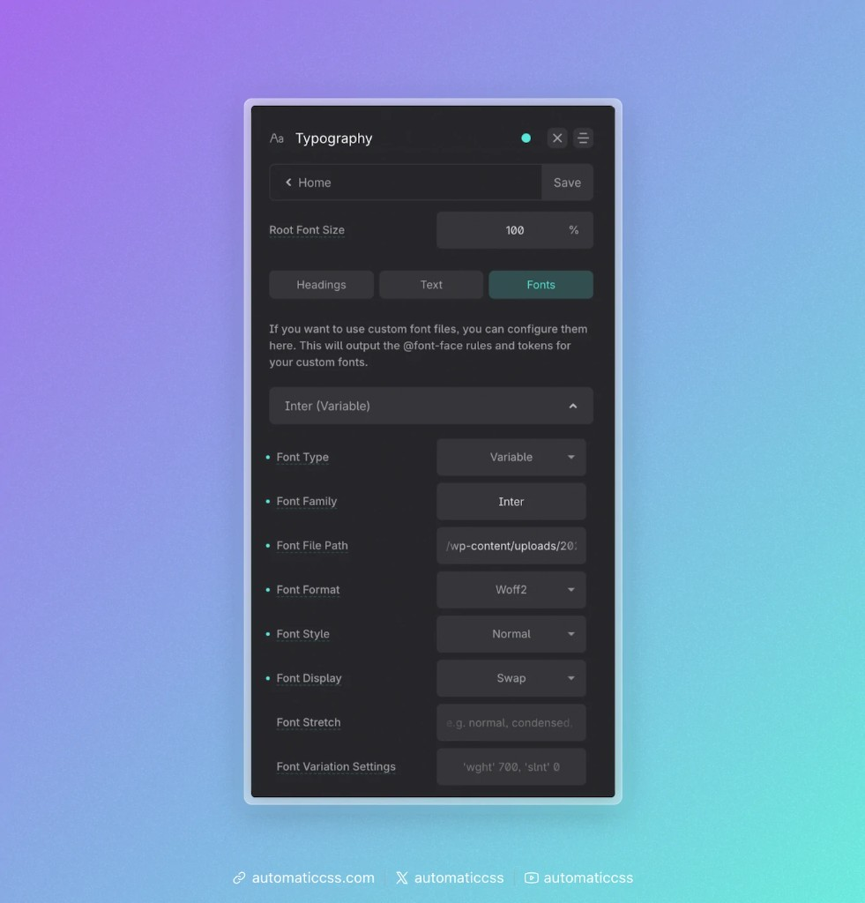
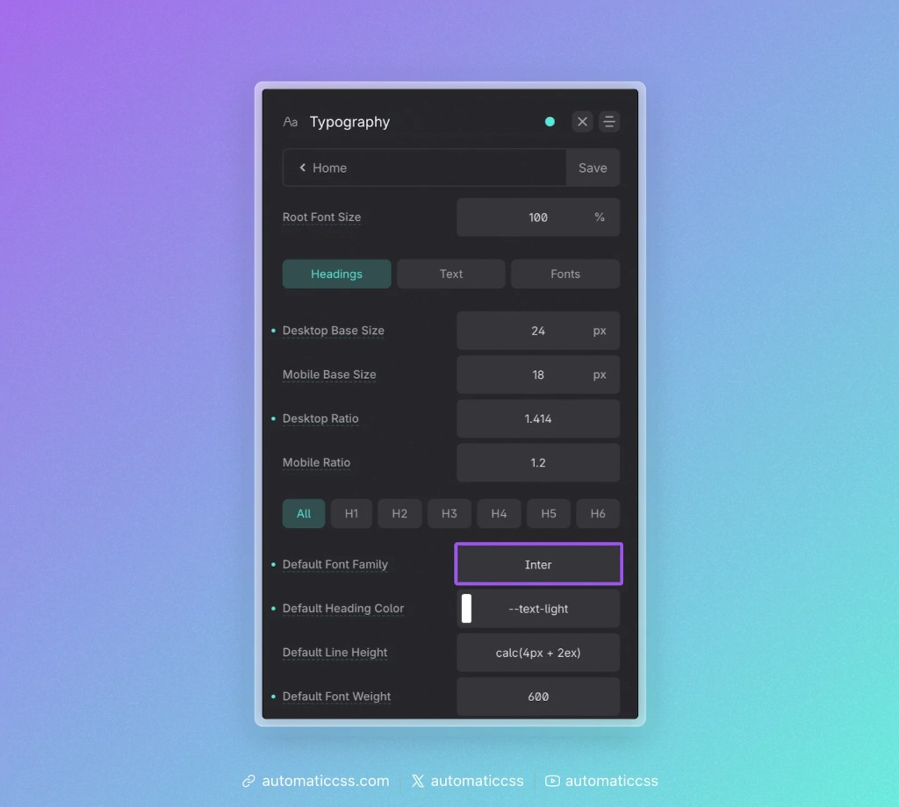

Automatic.css lets you register your own self-hosted font files directly from the dashboard. When you configure a custom font, ACSS automatically outputs the `@font-face` rule for you, so you can use the font anywhere on your site without hand-writing any CSS.

You can register up to **five** custom fonts.

## When to use custom fonts

Use this feature when you want to **self-host** a font (rather than loading it from a third-party service like Google Fonts). Self-hosting is the recommended approach for performance and privacy: the font is served from your own server, with no external requests.

If you only need a system font or a font that another plugin/theme already loads, you don't need to register it here — you can simply reference the font family name in your typography settings.

## Step 1: Upload your font file

Before configuring anything in the dashboard, upload your font file(s) to your server — typically through the WordPress Media Library or via SFTP into `/wp-content/uploads/`.

`.woff2` is the recommended format for the web because it offers the best compression and broad browser support.

Make note of the **relative path** to the file (for example, `/wp-content/uploads/2025/your-font.woff2`). You'll need it in the next step.

## Step 2: Add the font in the dashboard

Open the **Typography** panel and switch to the **Fonts** tab. Expand one of the font accordions (Font 1–5) and fill in the fields.



| Field | Description |
|-------|-------------|
| **Font Type** | Choose **Static** for a standard font file (one weight/style), or **Variable** for a variable font that contains multiple weights/styles in a single file. |
| **Font Family** | The name you'll use to reference this font. It can be anything you like — it's just a label (e.g. `Inter`). |
| **Font File Path** | The **relative** path to your uploaded font file (e.g. `/wp-content/uploads/2025/your-font.woff2`). |
| **Font Format** | The format of the file you referenced — `woff2`, `woff`, `truetype`, or `opentype`. |
| **Font Style** | Optional. The `font-style` for this file (`normal`, `italic`, or `oblique`). |
| **Font Weight** | _(Static fonts only.)_ The `font-weight` of this file. Make sure it matches the actual file you uploaded (e.g. `400`, `600`, `700`). |
| **Font Display** | Optional. The `font-display` strategy (`auto`, `block`, `swap`, `fallback`, or `optional`). `swap` is a common, performance-friendly choice. |
| **Font Stretch** | _(Variable fonts only.)_ The `font-stretch` value (e.g. `normal`, `condensed`, `expanded`). |
| **Font Variation Settings** | _(Variable fonts only.)_ The `font-variation-settings` value for the variable font (e.g. `'wght' 700, 'slnt' 0`). |

### Fallbacks

Each font has an optional **Fallbacks** section where you can provide a second **Font File Path** and **Font Format**. This isn't required, but it's good practice: if the primary file fails to load, the browser will try the fallback file instead.

### Static vs. variable fonts

- A **static** font file contains a single weight and style. If you need multiple weights (e.g. regular and bold), upload each weight as its own font using the same **Font Family** name but a different **Font Weight** — the browser will pick the correct file automatically.
- A **variable** font packs many weights/styles into one file. Use the **Font Stretch** and **Font Variation Settings** fields to control how it renders.

When you're done, click **Save**. ACSS regenerates your stylesheet and the `@font-face` rule(s) are now active on your site.

## Step 3: Use your custom font

Registering a font outputs the `@font-face` rule, but it doesn't automatically apply the font anywhere. To use it, reference the **Font Family** name you chose.

The most common way is to set it as your default heading or text font. In the **Headings** (or **Text**) tab, enter your font family name in the **Default Font Family** field. You can also override it per heading level (H1–H6) or per text size.



You can also reference your font anywhere in custom CSS, just like any other font family:

```css
.my-element {
  font-family: "Inter", sans-serif;
}
```

Because ACSS exposes your typography settings as variables, you can also keep custom elements in sync with your global typography. See [Typography Variables](typography-variables.md) for details on variables like `--heading-font-family` and `--text-font-family`.

## Tips & troubleshooting

- **Use a relative path**, not a full URL. Start the path at `/wp-content/...`.
- **Match the format to the file.** If you reference a `.woff2` file, set the format to `woff2`.
- **Font not showing up?** Double-check the file path is correct and the file is actually present on the server. Then make sure the **Font Family** name you typed in your typography settings exactly matches the name you used when registering the font.
- **Weights look wrong?** For static fonts, confirm the **Font Weight** you entered matches the weight of the file you uploaded.
